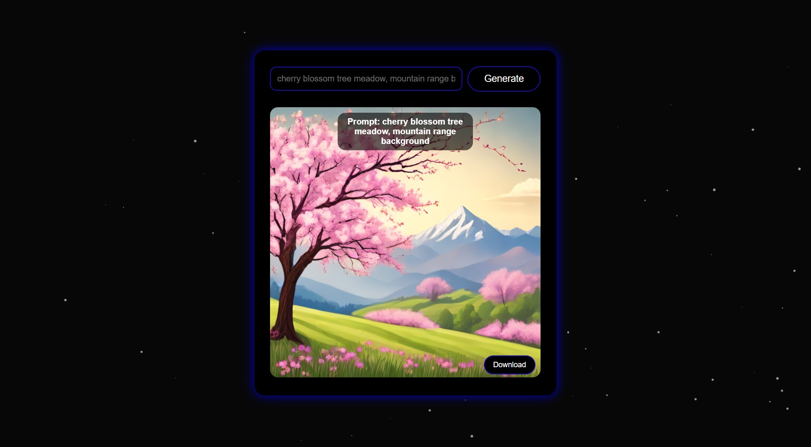

# ComfyUI Simple Web API

> **Note**: This project is not affiliated with or endorsed by the original ComfyUI project. It is an independent interface created by the community.

## Overview

The ComfyUI Simple Web API provides a super simple web interface for generating images using ComfyUI. This project is designed to be user-friendly, allowing individuals with no technical knowledge to create and download images effortlessly.

<p align="center">
  
</p>

## Features

- **User-Friendly Interface**: A clean and intuitive web interface that makes it easy for anyone to generate images.
- **Prompt-Based Image Generation**: Users can input text prompts to generate images.
- **Image Download**: Generated images can be easily downloaded directly from the web interface.
- **Image Retention**: The system retains the last 20 generated images, automatically deleting older ones to save space.

## How It Works

1. **Web Interface**: Users interact with a simple web page where they can enter text prompts.
2. **Image Generation**: The backend processes the prompt using ComfyUI and generates an image.
3. **Image Display and Download**: The generated image is displayed on the web page, and users can download it with a single click.

## Project Structure

- **app.py**: The main Flask application that handles web requests and image generation.
- **comfyapi.py**: Contains functions to interact with ComfyUI, including loading configurations and workflows, and generating images.
- **config.yaml**: Configuration file specifying server address, workflow path, node IDs, and other settings.
- **workflows/workflow-noserversave.json**: Workflow configuration for ComfyUI.
- **templates/index.html**: HTML template for the web interface.

## Getting Started

### Prerequisites

- Python 3.x
- Flask
- websocket-client
- PyYAML

### Installation

1. Clone the repository:
    ```sh
    git clone https://github.com/Tiefflieger06/comfyui-simple-frontend.git
    cd comfyui-simple-frontend
    ```

2. Install the required Python packages:
    ```sh
    pip install -r requirements.txt
    ```

### Running the Application

1. Start the Flask application:
    ```sh
    python app.py
    ```

2. Open your web browser and navigate to `http://127.0.0.1:1111`.

### Usage

1. Enter a text prompt in the input field on the web page.
2. Click the "Generate" button.
3. Wait for the image to be generated and displayed.
4. Click the "Download Image" button to save the image to your device.

## Configuration

- **config.yaml**: Modify this file to change server settings, workflow paths, and node IDs.
- **workflows/workflow-noserversave.json**: Customize the workflow configuration as needed. You can also use your own workflow that can be obtained through the main ComfyUI interface (Workflow -> Export (API)). Make sure to update the config appropriately!

## Contributing

Contributions are welcome! Please fork the repository and submit a pull request with your changes.

## License

This project is licensed under the GNU General Public License v3.0 (GPLv3). See the LICENSE file for details.